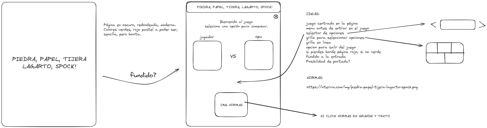

# Rock, Paper, Scissors, Lizard, Spock

This is a proyect to practice everithing learned in class.

The proyect consist of developing the rock, paper, scissors, lizard, spock game with HTML, CSS and JAVASCRIPT.

## What characteristics does it present?

The caracteristics does it have are simplicity, beauty and functionality.

## Brainstorm

## Resources

[CoolContrast](https://coolcontrast.vercel.app/)
[UIColorsApp](https://uicolors.app/)